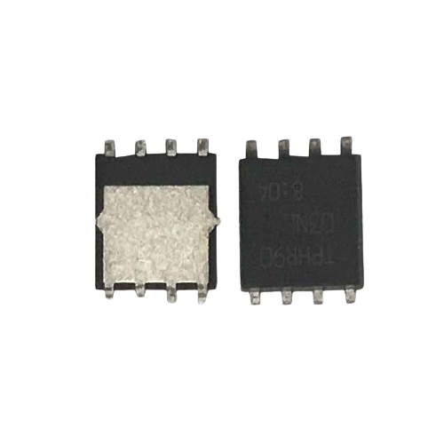
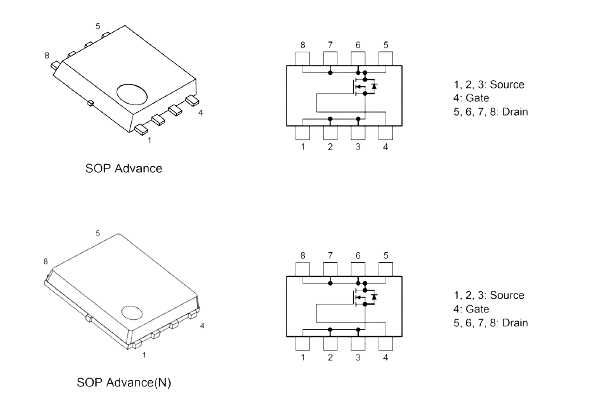
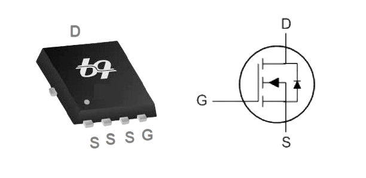
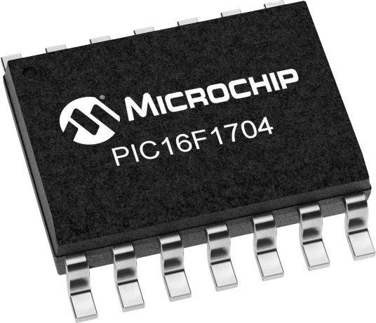

# Antminer S9 Components

## N-Channel 30V Fast Switching MOSFET

#### [TPHR9003NL](../../../Assets/TPHR9003NL.pdf)

#### [QN3109M6N](../../../Assets/QN3109M6N.pdf)

## PIC

### [PIC16F1704-I/SL](https://www.digikey.com/en/products/detail/microchip-technology/PIC16F1704-I-SL/4439823)

